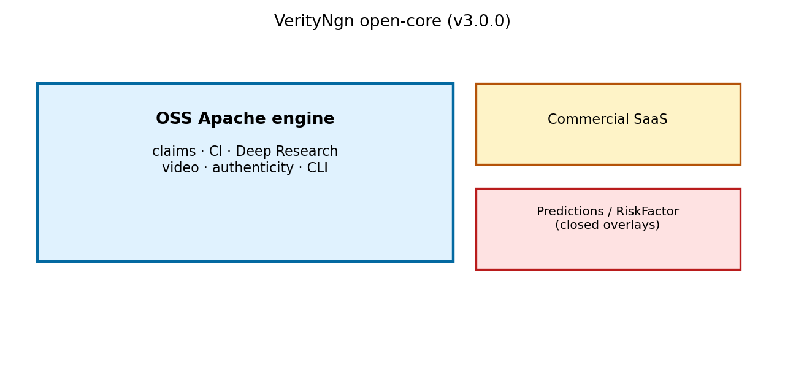
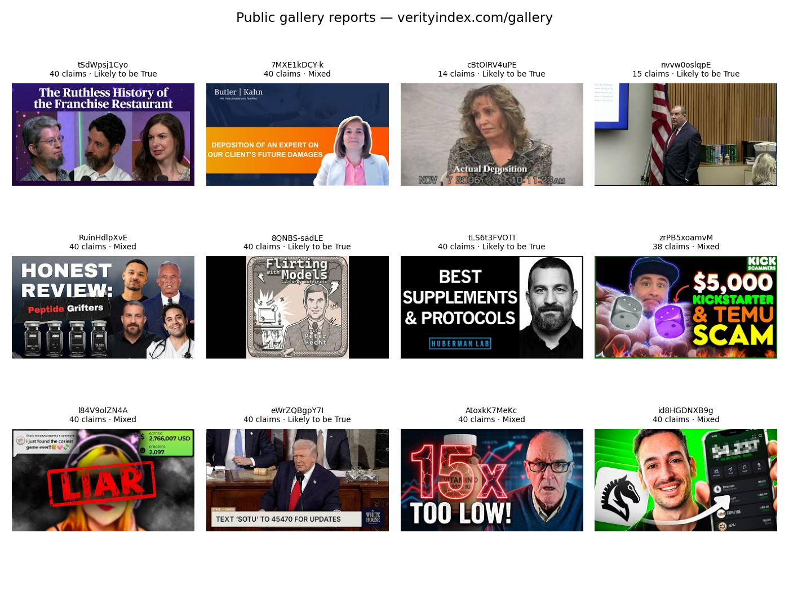
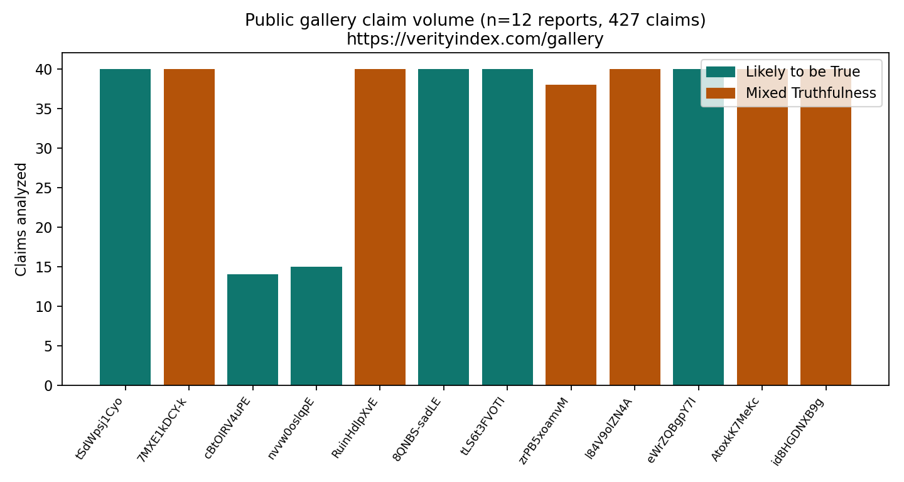
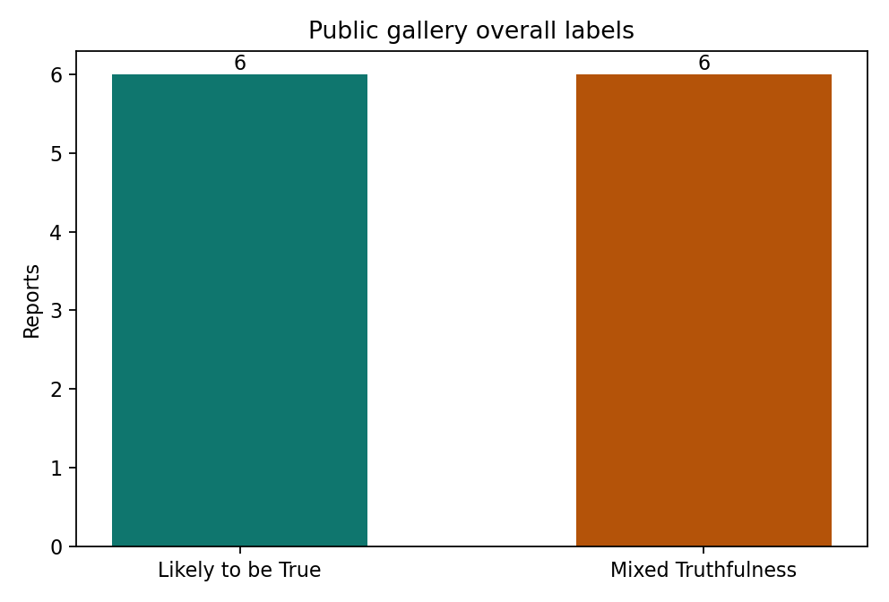
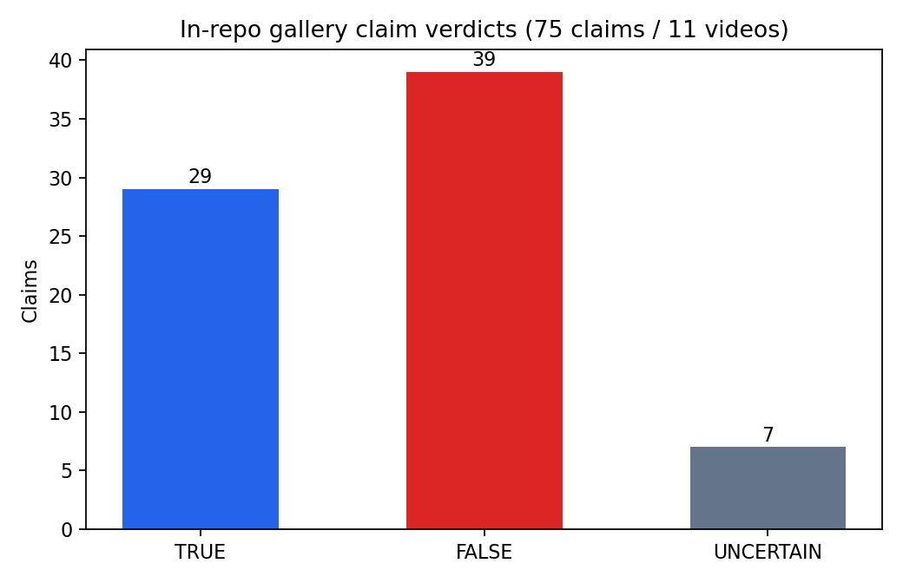
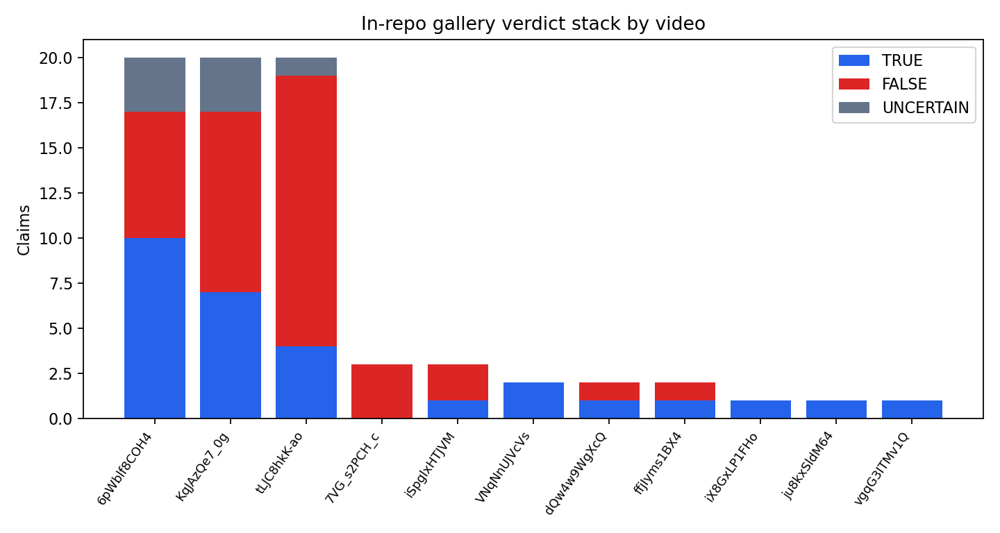
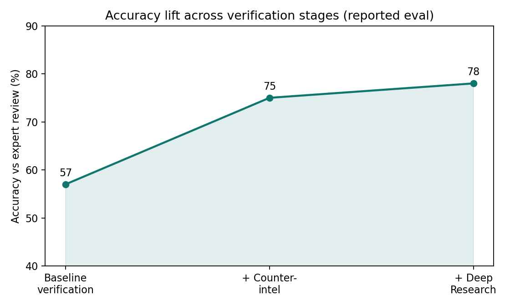

# VerityNgn OSS 3.0.0 — Public Engine Release Paper

**Authors:** HotChili Analytics / VerityNgn Research  
**Date:** 2026-08-29  
**Version:** 3.0.0  
**License:** Apache-2.0 (engine); commercial overlays under separate terms  
**Live gallery:** https://verityindex.com/gallery  
**GitHub release:** https://github.com/hotchilianalytics/verityngn-oss/releases/tag/v3.0.0  

> Prefer the print HTML/PDF: build with `python scripts/build_release_paper_html.py`, then `bash scripts/render_release_paper_pdf.sh` (Chromium via Playwright — run outside Cursor).

---

## Abstract

We release **VerityNgn OSS 3.0.0**, a standalone open-source multimodal engine for claim extraction and verification from video. This release restores **Deep Research** (grounded forensic summarization) to the public Apache tree, adds optional **authenticity** and **spectral voice** cues, and documents a clear open-core boundary: predictions and RiskFactor products remain closed overlays that **depend on OSS**, not the reverse. We do not claim earnings prediction, allocation factors, or lie detection.

**Keywords:** video verification, counter-intelligence, deep research, open-core, multimodal LLM

---

## 1. Motivation

Prior open-core practice left Deep Research and several authenticity cues on the commercial fork, while OSS drifted. Public distribution requires an impressive, drop-in engine (`pip install verityngn`) that communities can run without SaaS.



*Figure 1. OSS Apache engine vs closed commercial and predictions/RiskFactor overlays.*

---

## 2. System overview (v3 + v3.1 addendum)

### Analysis tiers (v3.1)

| Tier | Input | Pipeline | Typical latency |
|------|-------|----------|-----------------|
| `light` | YouTube URL | VTT → DR-direct | ~60s |
| `full` | YouTube URL | VTT cache + full CI/verify + optional DR | minutes |
| `local-light` | `.mp4` | sidecar transcript → DR-direct | ~60s |
| `local-full` | `.mp4` | full pipeline + optional DR | minutes |

```bash
verityngn analyze --tier light 'https://www.youtube.com/watch?v=VIDEO_ID'
verityngn analyze --tier full 'https://www.youtube.com/watch?v=VIDEO_ID' --deep
verityngn captions 'https://www.youtube.com/watch?v=VIDEO_ID'   # operator VTT debug
```

Caption reliability: cached `.en.vtt` / `.vendor.vtt` → yt-dlp (`player_client=android` + `cookies.txt`) → `youtube_transcript_api` → **Supadata** (opt-in `SUPADATA_API_KEY`) → Groq ASR (opt-in) → **Gemini YouTube URL** (`.gemini.vtt`). YouTube Data API metadata alone does **not** download third-party `.en.vtt`. See `docs/guides/YOUTUBE_CAPTIONS.md`. **T-TX-002 v2:** Supadata native **4/6** live (~8.6 s); yt-dlp **5/6**.

#### Why `.en.vtt` is not a simple API call (Sherlock T-VTT-001)

| Path | Works for public third-party videos? |
|------|--------------------------------------|
| YouTube Data API `videos.list` | Metadata only — no VTT |
| `captions.download` (OAuth) | **Owner-only** — 403 for others |
| `youtube_transcript_api` | Often **HTTP 200 + empty body** when PoToken (`&exp=xpe`) required |
| yt-dlp + android + cookies | Works when cookies fresh; SABR otherwise |
| Supadata (`SUPADATA_API_KEY`) | **Live (T-TX-002 v2):** native OK on captioned + Alphabet; free-tier 429 under burst; hard C4 generate pending |
| Gemini YouTube URL | Synthetic transcript — not official captions |

### §2.1 Ablation: VTT→DR vs report-JSON→DR (T-ABL-005)

**Hypothesis:** Deep Research from cached `.en.vtt` + DR-direct (`--tier light`) is faster but misses the structured claim inventory that full pipeline + DR consumes.

**Seed:** `tLJC8hkK-ao` (Lipozem VSL — spoken-heavy; cite as weak multimodal proof per T-ABL-004).

| Arm | Input | DR elapsed | Claims in payload | `[Reference:]` count | Topic Jaccard vs other arm |
|-----|-------|------------|-------------------|----------------------|----------------------------|
| **VTT → DR** | 50,003-char cached `.en.vtt` | **15 s** | 0 | 12 | — |
| **JSON → DR** | `{id}_report.json` (40 verified claims) | **20 s** | 40 | 23 | **0.22** |

**Decision:** `keep_full_default` — DR-only on transcript is ~3× faster than full pipeline+DR (892 s in T-ABL-001) but lexical overlap with inventory-grounded DR remains low. Light tier is a **triage path**, not a replacement for audit/CI.

Full pipeline + DR (T-ABL-001): topic Jaccard **0.058** between full standard report MD and DR-direct without transcript (v2 bug); with VTT loaded, VTT→DR vs JSON→DR Jaccard rises to **0.22** but still supports keeping full as default.

Artefact: `outputs/ablation_vtt_json_dr_tL_v3/compare_vtt_json_dr.json` · script: `scripts/run_vtt_json_dr_ablation.py`.

### Adaptive vision sleeve (v3.1)

Genre-aware FPS/resolution sampling (`services/vision/adaptive_sampler.py`), exhibit maps for legal dossiers, and brand-safety visual flags. Validated on genre seeds (earnings slides, UGC supers) — not talk-heavy VSLs (T-ABL-004).

```
Video URL or file
  → (optional) VTT cache via caption_fetch
  → multimodal analysis + claim extraction
  → counter-intelligence (YouTube / press-release / Sherlock CI)
  → probabilistic verification (TRUE / FALSE / UNCERTAIN)
  → standard report (MD / HTML / JSON / PDF)
  → optional Deep Research (Gemini grounded pass + combined report)
  → optional authenticity / spectral / Face Landmarker cues
```

### Deep Research (now in OSS)

`verityngn analyze <url> --deep` produces `{video_id}_deep_private_report.{md,html,pdf}` plus grounding audit JSON.

### Explicitly out of this release

Predictions signal engine, CAR/ICIR, Karp panels, RiskFactor S00–S15, hosted trial credits, full Gemini multisense fusion (deferred).

---

## 3. Live gallery evidence (verityindex.com)

Scraped **2026-08-29** from https://verityindex.com/gallery:

| Metric | Value |
|--------|-------|
| Public reports | **12** |
| Claims analyzed | **427** |
| Likely to be True | 6 reports |
| Mixed Truthfulness | 6 reports |



*Figure 2. Public gallery cards (YouTube thumbnails).*



*Figure 3. Claims analyzed per public gallery report.*



*Figure 4. Overall gallery labels.*

Machine-readable snapshot: [`figures/gallery_live_stats.json`](figures/gallery_live_stats.json).

Editorial labels on the gallery are HotChili Analytics LLM assessments — **not** YouTube data.

---

## 4. In-repo gallery claim mix

From `ui/gallery/approved/` report JSONs (claim-level verification fields):

| Metric | Value |
|--------|-------|
| Videos | 11 |
| Claims with verdicts | 75 |
| TRUE / FALSE / UNCERTAIN | 29 / 39 / 7 |



*Figure 5. Claim-level verdict mix (in-repo approved gallery).*



*Figure 6. Per-video stacked verdicts.*



*Figure 7. Prior evaluation narrative: accuracy lift across stages.*

---

## 5. Install & CLI

```bash
pip install 'verityngn[deep]'
verityngn analyze 'https://www.youtube.com/watch?v=VIDEO_ID'
verityngn analyze --tier light 'https://www.youtube.com/watch?v=VIDEO_ID'
verityngn analyze 'https://www.youtube.com/watch?v=VIDEO_ID' --deep
verityngn analyze --file deposition.mp4 --title "Matter clip" --tier local-full
```

Credentials: Vertex ADC or `VERITY_GEMINI_KEY` / `GEMINI_API_KEY` (see `.env.example`). Captions: `YTDLP_COOKIES` or repo `cookies.txt`.

---

## 6. Open-core dependency model

Future commercial, predictions, and RiskFactor repositories pin **OSS ≥3.0.0**. Boundary CI fails if `services/predictions` or `services/quant` appear under the public package. See `docs/OPEN_CORE.md`.

---

## 7. What we will not claim

- No earnings prediction or allocation alpha
- No “lie detector” branding
- No RiskFactor registry scores in this paper

---

## Changelog pointer

See repository `CHANGELOG.md` → `[3.0.0] - 2026-08-29`.
