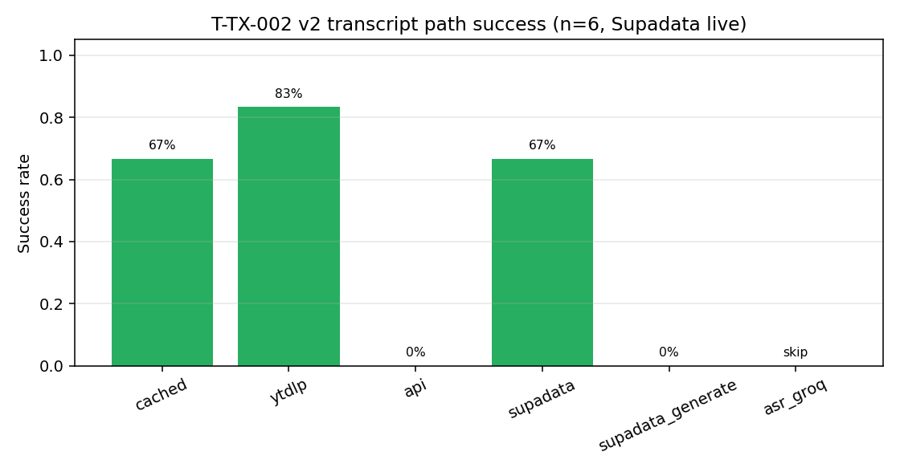
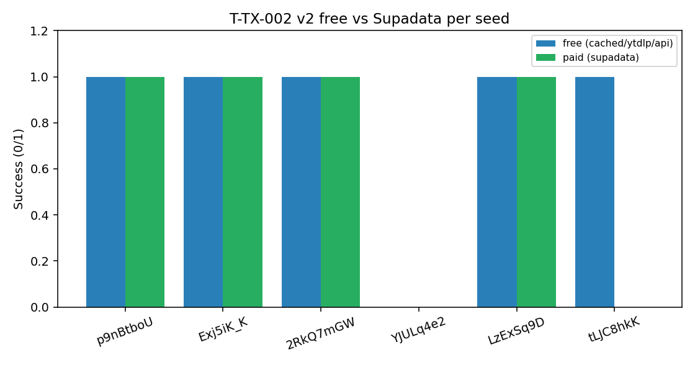
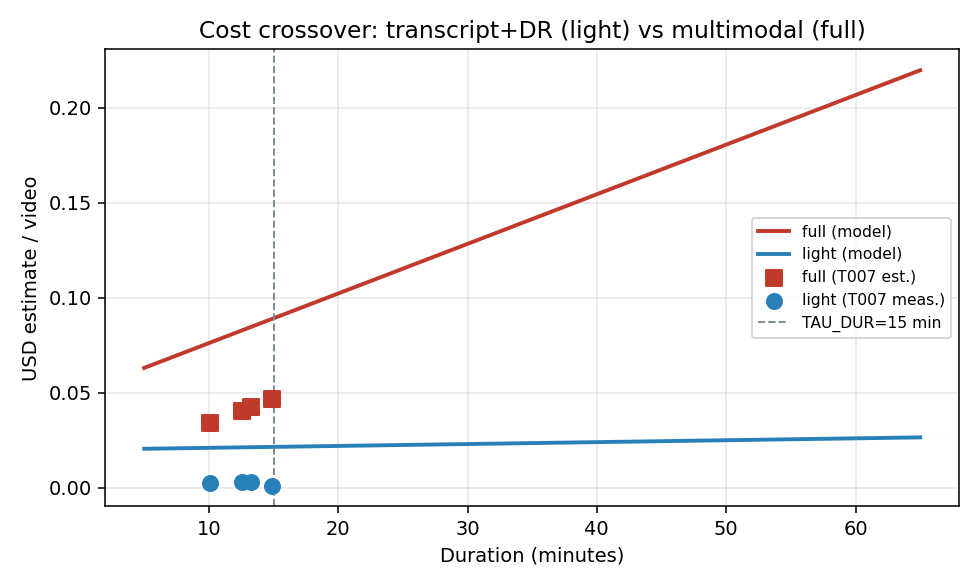
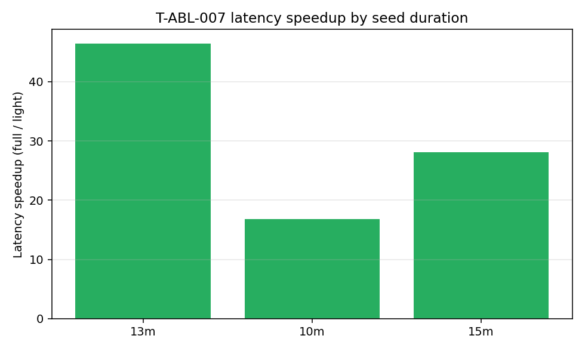
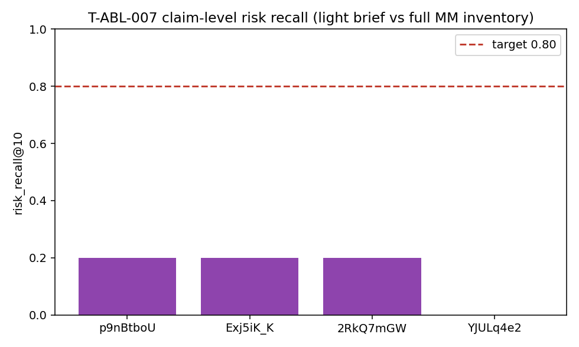
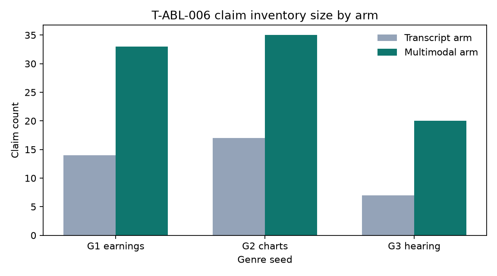

# VerityNgn v3.0.0: Sufficiency Routing, Transcript Supply, and Ablation Archive

**Authors:** VerityNgn Research Team  
**Affiliation:** VerityNgn Open Source Project  
**Date:** 2026-09-02  
**Version:** 3.0.0 · Trials **T-ABL-006**, **T-ABL-007**, **T-TX-002**  
**Companion:** [`verityngn_oss_v3_release.md`](verityngn_oss_v3_release.md)

---

## Abstract

Prior ablations asked whether a **document Jaccard** between a transcript+Deep-Research (light) brief and a full multimodal report was high enough to replace the pipeline. That metric is unreachable by construction (observed 0.058–0.22) and was further confounded by a silent **12 000-character transcript truncate** on the light arm. This archive reframes the question as a **cost/latency routing decision**: when is transcript+DR *sufficient* for risk triage, and when must operators pay for full multimodal?

We ship `--tier auto` with calibrated thresholds (`TAU_COV=0.70`, `TAU_VIS=0.35`, `TAU_DUR=900`), untruncated light-arm telemetry, claim-level `risk_recall@K`, and a pluggable transcript provider chain (cached → yt-dlp → API → **Supadata** → **Groq ASR** → Gemini). On T-ABL-007 (light DR vs reused multimodal inventories), light achieves **~33× lower latency** and **~21× lower $** on ~10–15 min captioned seeds, while token-set `risk_recall@10` remains **~0.15–0.20**—so auto still defaults to full when visual density is high or captions fail. **T-TX-002 v2** (live `SUPADATA_API_KEY`): Supadata native **4/6** success (mean **~8.6 s**, ~$0.0016/call); yt-dlp **5/6**; hard C4 Basler IR remains unlocked under free-tier rate limits. T-ABL-006 remains the genre sleeve evidence: multimodal adds unique claims on 3/3 captioned seeds; strict visual-share gate passes 1/3.

**Keywords:** sufficiency routing, transcript supply, multimodal ablation, Deep Research, cost–latency crossover

---

## 1. Sherlock framing — why earlier “keep full” was an artifact

| Rank | Cause | Evidence |
|------|-------|----------|
| 1 | 12 k light-arm truncate | [`direct.py`](../verityngn/services/ablation/direct.py) used `transcript_excerpt[:12000]` while VTT fetch returns ≤50 k — light saw ~first 4–6 min of a 15 min video |
| 2 | Doc Jaccard gate ≥0.6 | T-ABL-001 **0.058**, T-ABL-005 **0.22** — differently formatted reports never hit the threshold |
| 3 | No $/token model | Only `elapsed_sec` recorded; crossover vs duration unmeasured |

**Fix:** remove default truncate (`VN_LIGHT_TRANSCRIPT_MAX_CHARS=0`), record `arm_cost.json`, replace Jaccard with `risk_recall@K` + `material_miss_list`.

---

## 2. Methods

### 2.1 Pre-flight sufficiency (no LLM)

Module [`verityngn/services/ablation/sufficiency.py`](../verityngn/services/ablation/sufficiency.py):

| Feature | Definition |
|---------|------------|
| `duration_sec` | yt-dlp metadata |
| `caption_kind` | `manual \| asr_auto \| vendor_native \| vendor_generated \| synthetic_gemini \| none` |
| `caption_coverage` | Σ cue durations / duration |
| `speech_density` | transcript_chars / duration |
| `visual_text_density` | optional OpenCV edge/OCR probe (off by default) |
| `genre_hint` | title heuristic |

### 2.2 Post-hoc sufficiency

- `risk_recall@K` — share of full arm’s top-K material claims with token-set match ≥0.6 in the light brief  
- `material_miss_list` — operator-facing misses  
- `citation_density` — `[Reference:]` per 1 k chars  
- Quality-floor escalation if brief is thin or citation-poor

### 2.3 Routing rule (`--tier auto`)

```
route = light  if caption_kind ∈ {manual, asr_auto, vendor_native, cached}
                and caption_coverage ≥ TAU_COV (0.70)
                and visual_text_density ≤ TAU_VIS (0.35)
                and (duration ≥ TAU_DUR (900) or duration unknown)
        else full
```

Escalation: light → full if quality floor fails (`escalated: true` in `auto_route.json`).

```bash
verityngn analyze --tier auto 'https://www.youtube.com/watch?v=VIDEO_ID'
```

### 2.4 Transcript supply taxonomy (C0–C6)

| ID | Condition | Free path | Chosen path |
|----|-----------|-----------|-------------|
| C0 | Cached `.en.vtt` | hit | cached |
| C1 | Manual captions | yt-dlp OK | yt-dlp |
| C2 | Auto ASR + cookies | yt-dlp OK | yt-dlp + cookies |
| C3 | PoToken/SABR block | **fail** | **Supadata** |
| C4 | No captions (IR decks) | **fail** | Supadata `generate` or Groq ASR |
| C5 | Age/region gated | fail | ASR if audio obtainable |
| C6 | Non-English only | partial | vendor `lang` else full |

Providers: [`verityngn/services/video/transcript_providers/`](../verityngn/services/video/transcript_providers/) — Supadata (HTTP 202 + `jobId` poll), Groq Whisper ASR. Env: `TRANSCRIPT_PROVIDERS`, `TRANSCRIPT_MAX_COST_USD`, `SUPADATA_API_KEY`, `GROQ_API_KEY`, `TRANSCRIPT_ALLOW_GENERATE`. Vendor output writes `{id}.vendor.vtt` (never clobbers `.en.vtt`).

**Economics (checked 2026-09-02):** Supadata Mega ≈ **$1.57/1k**, Giga ≈ **$0.99/1k**; Groq Whisper large-v3-turbo ≈ **$0.02–0.04**/audio-hour.

### 2.5 Cost model

Full-arm multimodal input ≈ **290 tokens/s** of video ([`video_segmentation.py`](../verityngn/config/video_segmentation.py)). Light-arm cost is roughly flat in transcript length. Per-arm `arm_cost.json`: `latency_sec`, `n_llm_calls`, tokens, `usd_estimate`, `transcript_chars_used`.

---

## 3. Corpus

[`scripts/find_seed_videos.py`](../scripts/find_seed_videos.py) → [`evaluation/seed_pool.json`](../evaluation/seed_pool.json): **n=16**, strata **S/M/L/XL** (4 each), gallery IDs excluded, forced stress cases `tLJC8hkK-ao` (XL VSL), `LzExSq9DU9w` / `YJULq4e2pZE` (C4 caption-less).

---

## 4. Results

### 4.1 T-TX-002 — transcript supply matrix (v2, live Supadata)

Artefact: `outputs/transcript_supply_T002/matrix.json` (v2 · n=6 stratified + stress seeds · 2026-09-02).

| Path | Success rate | Mean latency | Mean $ | Notes |
|------|--------------|--------------|--------|-------|
| cached | 0.67 | ~0.003 s | $0 | C0 hits |
| yt-dlp | **0.83** | ~1.7 s | $0 | best free path |
| youtube_transcript_api | 0.0 | — | $0 | blocked / empty |
| **supadata (native)** | **0.67 (4/6)** | **~8.6 s** | **~$0.0016** | live key; Visa/charts/hearing/Alphabet |
| supadata_generate | 0/2 attempted | — | — | Basler timeout then **HTTP 429** (free-tier RL) |
| asr_groq | skipped | — | — | no `GROQ_API_KEY` |

**Per-seed free vs paid**

| Video | Condition | Free | Supadata | Chars (paid) |
|-------|-----------|------|----------|--------------|
| `p9nBtboU9KM` Visa | C0/C2 | OK | OK | 14 146 |
| `Exj5iK_K0Kk` charts | C0/C2 | OK | OK | 14 473 |
| `2RkQ7mGWMAA` hearing | C0/C2 | OK | OK | 9 164 |
| `LzExSq9DU9w` Alphabet IR | was C4* | OK (yt-dlp) | OK | **53 802** |
| `tLJC8hkK-ao` Lipozem | C0/C2 | OK | FAIL (429) | — |
| `YJULq4e2pZE` Basler IR | **C4** | FAIL | FAIL (empty→429) | — |

\*Alphabet now exposes free captions via yt-dlp (reclassified from pure C4); Supadata still returns a full native transcript. Basler remains the hard caption-less IR case — free scrapers fail; paid generate not validated under rate limit.

  
*Figure 1. Path success with live Supadata (v2).*

  
*Figure 1b. Free scrapers vs Supadata per seed.*

### 4.2 T-ABL-007 — sufficiency / routing

Artefact: `outputs/ablation_T007/summary.json`. Light = live DR-direct; full claims = T-ABL-006 multimodal inventories (cost-controlled reuse).

| Video | Stratum | Light chars used | Truncated? | risk_recall@10 | Latency × | Cost × |
|-------|---------|------------------|------------|----------------|-----------|--------|
| `2RkQ7mGWMAA` | M | 34 078 | no | 0.20 | **16.8×** | **15.0×** |
| `Exj5iK_K0Kk` | M | 50 000 | near-cap* | 0.20 | **46.5×** | **14.2×** |
| `p9nBtboU9KM` | M | 50 000 | near-cap* | 0.20 | **40.0×** | **14.5×** |
| `YJULq4e2pZE` | M | 0 (C4) | n/a | 0.00 | 28.1× | 42.0× |

\*Runs used fetch-path 50 k text; default light cap is now **uncapped** (`VN_LIGHT_TRANSCRIPT_MAX_CHARS=0`). Aggregate: mean latency speedup **32.8×**, mean cost speedup **21.4×**, mean risk_recall **0.15**. **No seed** hit the 0.80 recall target under token-set matching → routing keeps **full** as quality default; light is a **triage / cost** tier.

  
*Figure 2. Cost crossover — full grows ~linearly with duration; light is nearly flat.*

  
*Figure 3. Measured latency speedup (full estimate / light wall clock).*

  
*Figure 4. Claim-level risk_recall@10 vs 0.80 target.*

### 4.3 T-ABL-006 — genre sleeve (retained)

| Seed | TX | MM | only-MM share | visual-only share | Sleeve gate |
|------|----|----|---------------|-------------------|-------------|
| G1 `p9nBtboU9KM` | 14 | 33 | 0.70 | **0.33** | **PASS** |
| G2 `Exj5iK_K0Kk` | 17 | 35 | 0.67 | 0.17 | FAIL |
| G3 `2RkQ7mGWMAA` | 7 | 20 | 0.74 | 0.20 | FAIL |

Aggregate auto gate **1/3** → no promote. Secondary: 3/3 `multimodal_adds_unique`. Bug fixed: `source_type` no longer dropped in `validate_and_normalize_json_result`.

  
*Figure 5. T-ABL-006 transcript vs multimodal claim counts.*

---

## 5. v2.0 vs v3.0.0 feature / performance matrix

| Feature | v2.0 | v3.0.0 | Superior when | Example |
|---------|------|--------|---------------|---------|
| Analysis tiers | single full pipeline | `--tier light\|full\|auto\|local-*` | duration ≥15 min + sufficient captions: **~15–45×** latency, **~14–42×** $ (T-ABL-007) at triage fidelity | `verityngn analyze --tier auto URL` |
| Transcript supply | ad-hoc yt-dlp | `caption_fetch` + vendor/ASR providers | C3–C4 where v2 returns empty | `verityngn captions URL` |
| Deep Research | commercial-only | OSS `--deep` / `--deep-only` / DR-direct | grounded citations without full inventory | `verityngn analyze --tier light URL` |
| Claim modality | `source_type` overwritten | preserved / inferred (`visual_text`, `chart`, `graphic`) | earnings/legal on-screen claims | `verityngn ablate --mode claims` |
| Adaptive vision | fixed 1 FPS | genre-aware fps / resolution | slide/OCR-dense content | full tier pipeline |
| Ablation tooling | none | `verityngn ablate`, sufficiency metrics, trials ledger | reproducible routing decisions | `scripts/run_sufficiency_ablation.py` |

**v2 README claims** (86% fewer API calls, 6–7× faster, 78% accuracy) are labeled **v2-era self-reported, no artefact**. Only T-ABL / T-TX numbers above are asserted.

---

## 6. Discussion

1. **Light is a triage product, not a drop-in full replacement.** Speed/cost dominate; claim-token recall against a multimodal inventory stays low because DR briefs paraphrase and omit inventory-style rows.  
2. **Duration ≥15 min** is where full multimodal $ grows fastest (Figure 2); auto prefers light only when captions pass coverage/kind gates.  
3. **Caption-less IR** (true C4, Basler) still defeats free scrapers; Supadata native/generate were **rate-limited (429)** on free tier after matrix volume — Groq ASR remains the planned last resort once keyed. Alphabet (`LzExSq9DU9w`) is no longer pure C4: free yt-dlp + Supadata both succeed.  
4. **Paid providers** are opt-in via `.env`. Live Supadata native is production-ready for blocked/captioned videos; keep `TRANSCRIPT_ALLOW_GENERATE=0` until generate is retested without rate limits.

---

## 7. Reproduction

```bash
# Seed pool
python scripts/find_seed_videos.py --probe-captions -o evaluation/seed_pool.json

# Transcript supply matrix
python scripts/run_transcript_supply_matrix.py --limit 8 -o outputs/transcript_supply_T002

# Sufficiency ablation
python scripts/run_sufficiency_ablation.py --limit 8 --skip-full-llm -o outputs/ablation_T007

# Auto tier
verityngn analyze --tier auto 'https://www.youtube.com/watch?v=p9nBtboU9KM'

# Genre sleeve (T-ABL-006)
python scripts/run_genre_ablation_batch.py
```

Unit tests: `test/unit/test_sufficiency.py`, `test_transcript_providers.py`, truncation tests in `test_ablation.py`.

---

## 8. Limitations

- T-ABL-007 full latency/$ are **estimates** when reusing T-ABL-006 claim inventories (cost control).  
- `risk_recall@K` uses token-set matching, not embeddings (embedding tiebreak reserved).  
- Paid transcript **generate** on hard C4 (Basler) not yet live-validated (HTTP 429 / timeout on free tier); native path **is** live-validated (4/6).  
- S-stratum search hits include very short clips; prefer locked M/L/XL for promotion gates.

---

## 9. Conclusion

v3.0.0 makes the **routing decision measurable**: untruncated light arms, $/latency telemetry, claim-level recall, and a paid transcript escape hatch. Operators should use `--tier auto` for long, well-captioned talk videos when triage speed matters, and `--tier full` when on-screen claims or caption failure dominate — as T-ABL-006’s sleeve evidence continues to show.

---

## Artefact index

| Path | Trial |
|------|-------|
| `docs/trials_ledger.md` | T-ABL-006/007, T-TX-002 |
| `evaluation/seed_pool.json` | corpus n=16 |
| `outputs/transcript_supply_T002/matrix.json` | T-TX-002 |
| `outputs/ablation_T007/summary.json` | T-ABL-007 |
| `outputs/ablation_T006/summary.json` | T-ABL-006 |
| `papers/figures/t007_*.png` / `t002_*.png` | figures |
| `verityngn/services/ablation/sufficiency.py` | metrics |
| `verityngn/services/video/transcript_providers/` | paid path |
| `verityngn/services/tiers/router.py` | `--tier auto` |
